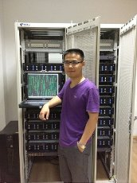
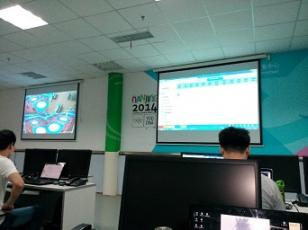

## 个人简历

----
### 个人信息/Personal Information
- 马越（Ma Yue）/男(Male)/1990 
- 工学硕士(Master of Science)
- 南京邮电大学软件工程专业(Software engineering,Nanjing University of Posts and Telecommunications)
- 技术博客(blog)：http://mayuenjkxt.blog.51cto.com/
- Github：[abner-ma](https://github.com/abner-ma "abner-ma")
- Email：

----

### 证书
- 服务器：[红帽认证工程师](cert/redhat/MY_RHCE.pdf)
- 数据库：[OCP证书](cert/oracle/MY-P.pdf)
- 编程语言：[JAVA SCP证书](cert/oracle/MY-SCJP.pdf)

----

### 工作经历 
#### ZTE ( 2016.9 ~ now)
_作为开发做编码工作_,主要为**C**。
```
`if ((time > 9) && (time < 21))
	work;`
```
#### 中国电信 （ 2015.7 ~ 2016.6 ）

##### 数据可视化项目 
工作中主要负责数据统计与分析，主要开发了部分门店酬金结算软件，以及根据生产库的数据，可视化显示门店销售热点图及门店分布图的网页功能开发，主要涉及到的技术有Docker,html/js,C等。
 
#### AtoS源讯中国公司 （ 2014.3 ~ 2014.8 ）

##### 青奥会成绩系统项目 
工作性质属于实习，担任职务为场馆成绩主管，主要负责南京青奥会的成绩系统的前期需求分析与数据测试，赛时则在场馆负责成绩系统的部署与维护。主要参与了人员管理模块中的人员到岗情况的汇总与分析功能，比赛成绩系统的ODF文件的解析验证功能及部分成绩发布页面的开发。

#### 南京建策公司 （ 2011.5 ~ 2011.10 ）
工作为实习，主要作为见习红帽讲师，负责红帽Linux的RHCSA及RHCE的内容的讲课，期间负责了RHCE考试环境搭建的脚本编写，并编写了相关的培训手册。[RHCE实验手册](resources/jiance/自己写的RHCE实验手册 v1.4.pdf)

---

### 主要项目经历 
- 虚拟化-云计算实验平台
<p>研究生期间参与江苏电信与南京邮电大学共建的虚拟化-云计算实验平台项目，主要负责实验环境的服务器、存储、交换机、防火墙的配置，以及超云平台、云桌面、Hadoop等软件环境的搭建，并使用该平台环境完成了中科院声学所的语音标注项目、Hadoop平台下海量小文件的处理研究。</p>
- 软件学院机房排课系统
<p>本科期间参与学院的Web排课系统项目的开发，项目以Web开发，主要参与排课模块的设计开发</p>

### 技术文章 

#### 发表的文章 
1. 硕士毕业论文：[Hadoop平台下的海量小文件处理研究](resources/njupt/1212043110_MY.pdf)
2. [基于Docker的应用软件虚拟化研究](resources/njupt/基于Docker的应用软件虚拟化研究.pdf)
3. [基于Docker的Hadoop平台架构研究](resources/njupt/基于Docker的Hadoop平台架构研究.pdf)

#### 演讲和讲义
 - 公司内部分享：[Hadoop分布式文件系统](resources/ct/Hadoop分布式文件系统.pptx)

---
